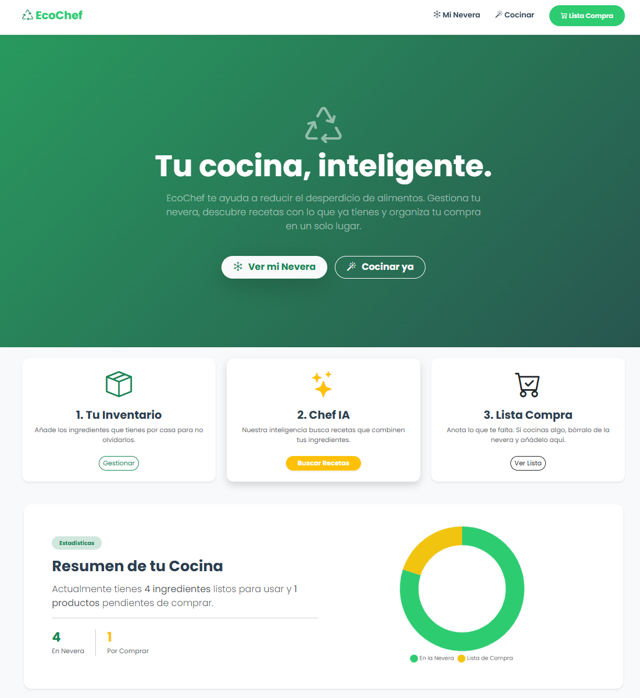
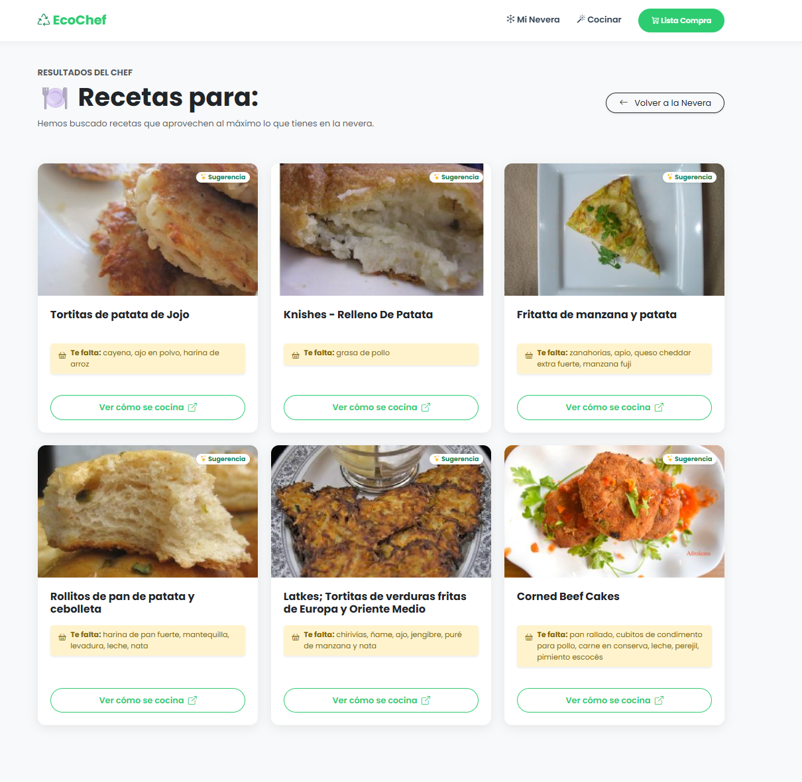

# EcoChef — cocina de residuo cero

Aplicación web que propone qué cocinar **con lo que ya tienes en la nevera**, en
lugar de elegir primero la receta y salir a comprar después. Trabajo de Fin de
Grado del Grado Superior en Desarrollo de Aplicaciones Web.

`Python` · `Flask` · `SQLAlchemy` · `SQLite` · `Bootstrap 5` · `Chart.js`



---

## El problema

En casa se tira comida por una razón tonta: no sabes qué tienes ni qué se puede
cocinar con ello antes de que caduque. Los recetarios están pensados al revés —
partes de la receta y acabas comprando cinco ingredientes nuevos, mientras lo que
ya tenías sigue en la nevera hasta que se estropea.

EcoChef invierte el flujo: el inventario es el punto de partida y las recetas son
la consecuencia.

## Qué hace

- **Inventario de la nevera.** Alta y baja de ingredientes sobre SQLite.
- **Buscador de recetas.** Toma todo lo que hay en la nevera y consulta la API de
  Spoonacular pidiendo las recetas que aprovechan **más ingredientes disponibles**
  (`ranking: 1`), no las más populares.
- **Detección de lo que falta.** Cruza la despensa con la receta y avisa de los
  ingredientes que habría que comprar.
- **Lista de la compra.** Con marcado de comprado / pendiente.
- **Panel de stock.** Gráficos con Chart.js sobre el contenido de la nevera.
- **Modo offline.** Si la API no responde, la aplicación sigue en pie con un
  conjunto de recetas local.



*Las recetas llegan ordenadas por cuántos ingredientes de la nevera aprovechan,
con el título traducido y el aviso de lo que falta para completarlas.*

## Decisiones técnicas

**Traducción en los dos sentidos.** Spoonacular solo entiende inglés y la
aplicación es en español. En lugar de obligar al usuario a escribir "chicken",
hay una capa con `deep-translator` que traduce los ingredientes al inglés antes de
consultar y devuelve títulos e ingredientes traducidos al español. Es lo que
permite que la interfaz sea castellana de principio a fin sin mantener un
diccionario propio.

**Respaldo local en vez de pantalla de error.** Una dependencia externa se cae, se
queda sin cuota o tarda demasiado; cuando eso pasa, la aplicación entra en modo
offline y sigue siendo usable en lugar de mostrar un error. La resiliencia se
diseña antes de necesitarla.

**Parche de resolución IPv4.** En Windows la librería de peticiones se colgaba
resolviendo el dominio de la API; el arranque fuerza IPv4 conservando la función
original de `socket` para no entrar en recursión infinita. Un caso de esos que no
salen en la documentación y se resuelven leyendo el traceback.

## Estructura

```
├── app.py            Rutas, modelos y lógica de recetas
├── requirements.txt  Dependencias
├── .env.example      Plantilla de variables de entorno
├── templates/        Vistas Jinja2: index, nevera, recetas, lista
├── static/css/       Estilos propios sobre Bootstrap
└── instance/         Base de datos SQLite (no se versiona)
```

Dos modelos: `Ingrediente` (lo que hay en la nevera) e `ItemCompra` (la lista de
la compra). La base de datos se crea sola al arrancar.

## Instalación

```bash
# 1. Clonar
git clone https://github.com/MiguelAngelRosingana/ecochef-tfg.git
cd ecochef-tfg

# 2. Entorno virtual
python -m venv venv
source venv/bin/activate      # en Windows: venv\Scripts\activate

# 3. Dependencias
pip install -r requirements.txt
```

**4. Clave de la API.** Consigue una gratuita en
[spoonacular.com/food-api](https://spoonacular.com/food-api), copia `.env.example`
a `.env` y pon la tuya:

```
SPOONACULAR_API_KEY=tu_clave_aqui
```

El `.env` está en el `.gitignore`: la clave nunca sale de tu máquina.

**5. Arrancar:**

```bash
python app.py
```

La aplicación queda en `http://127.0.0.1:5001`.

---

## English

A web app that suggests what to cook **with what is already in your fridge**,
instead of picking a recipe first and shopping afterwards. Final project of my
Higher Diploma in Web Application Development.

Flask and SQLAlchemy hold the inventory in SQLite; the recipe finder sends the
whole fridge to the Spoonacular API ranked by how many available ingredients each
recipe uses, and flags what is missing. Since the API only speaks English, a
two-way translation layer keeps the interface in Spanish without maintaining a
dictionary. A local fallback keeps the app usable when the API is unavailable.

---

**Miguel Ángel Rosingana Martín** · Data Analyst · Madrid
[Portfolio](https://miguelangelrosingana.github.io/portfolio/) ·
[LinkedIn](https://www.linkedin.com/in/miguel-angel-rosingana) ·
[miguel.rosin@gmail.com](mailto:miguel.rosin@gmail.com)
